# IEEE 1451 智能传感器接口标准介绍

简单地说，IEEE 1451 标准是为了统一传感器的“接口”的标准，使其网络化、智能化和标准化，让相互不同的、陌生的传感器接入系统后可以“自发现”、“自识别”和“自组网”，并自动的开始进行数据和命令的上下传递，使传感器具有“即插即用”性、兼容性、互操作性与相互独立的解耦性（与 USB 等规范不同，此标准专门适应了 智能传感器的弱处理能力、低功耗、设备信息标准格式定义与传输、特有功能等独特性需求）。

记录经过阅读十几篇介绍文章、PPT和论文后的一点粗浅的感悟（发现）。标准的初心是大家都遵守的规范，用得越多越好，这样大家都能互识、互联和互通。本文中许多中文名词为作者本人翻译自英文源文，非官方。成文辛苦，图片高达 44 张。本文所用到的图片侵删。如有没看懂的地方可在评论区留言，帮助进行通俗化改进；如有错误也请直言不讳。

写标准就是画饼，画饼是快乐的，读起来就能感觉到；技术路线确定后，实现就是个稍显无趣的体力活了。

------

## 名词/概念释义

1. 一个传感器（或叫变送器，Transducer）主动或者被动的采集数据并以一定格式上传到中控参与控制或以图表形式显示，这是采集系统最简单的形式的表述。

2. 一个传感器称得上为智能，有以下特征（标准 1451.0 定义的）：1、以数字的形式传递数据和命令，2、有统一的协议，3、提供触发、状态切换等可控制的功能；在作者看来，即传感器端加上一个微控制器（MCU，即漫威宇宙，啊不，即单片机）或者传感器端加上一个较复杂的 ASIC 专用逻辑芯片，实现以上功能，就算“智能”了。题外话，若更进一步，如果传感器的数据比较珍贵而且处理的计算量很大，传感器端可以上微处理器（MPU，或唤作 SoC），运行 Linux，该 SoC 带 GPU 等，再跑一些人工智能、深度学习算法，这算“边缘计算”的概念了。

   下图为一种“智能传感器”的释义。

   

   更多的，智能传感器具有的特征如下（实际无必要全囊括）：

   - 自描述；自识别；
   - 自诊断；自校准；
   - 定位信息，时间信息；
   - 数据聚合、处理和提取特征进行推理；
   - 报警通知；
   - 标准通讯接口和标准通讯协议。

   下图为工业现场背景下的一个智能传感器的示例（此图是通过无线的方式将数据发送出去），传感器会有成百上千个，而且类型也很多。

   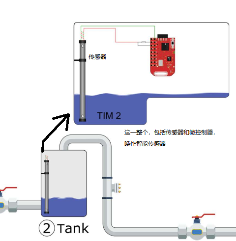

   

3. 现在 处理器平台 和 通讯/数据传输的接口 的繁多性，如下图。

   

4. 现在要很多个各式各样的智能传感器都可以连接到中控，要考虑两个方面：

   1. 指定标准的数据和命令的上下传输的协议；
   2. 指定一个标准的传感器“身份证”，让一个传感器接入系统后先发送这个亮明自己身份的“身份证”，上面有我是谁（传感器 ID、类型等）、我有啥、我能干啥等等信息。

   第一个问题，标准的数据和命令上下传输协议，在1451标准中，数据和命令的传输都属于消息传输范畴，数据消息只有指定以字节形式高位先传（MSB），用户自定协议，命令消息有严格的发送和接收格式；

   第二个中所讲的传感器的“身份证”，在1451标准中唤作 传感器电子数据表格（Transducer Electronic Data Sheet，TEDS）（源文翻译怪怪的），有严格的格式。这些协议或者叫格式的具体定义下文会引用标准源文讲到。下图为智能传感器带着TEDS的示例。

   

5. 连接传感器（也叫变送器）的模块，与传感器通讯拿到其数据，并以1451标准定义的协议上传这些数据的模块，这里叫做传感器接口模块（源文翻译）（Transducer Interface Module，TIM）。TEDS 存在于 TIM 中，实现自描述。

6. 上文的传感器接口模块（TIM）通过有线或者无线的形式以1451标准定义的协议上传上来的数据会首先送到一个应用处理模块，该模块经过分析处理这些数据再通过网络发出去，这个应用处理模块当作中间件起到中间转发和管理的作用，在这里叫做联网应用处理器（源文翻译）（Network Capable Application Processor，NCAP）。NCAP 接收 TIM 发送上来的 TEDS 并作解析，实现自识别，还有控制/管理各个 TIM 的用处。

## 标准簇/标准模型

IEEE 1451 标准制定了 TEDS 的格式以及 联网应用处理器端（NCAP） 和 智能传感器端（TIM） 之间的通讯规范等。1451 协议簇：

下图可以让系统的结构清晰起来，一个 1451 模型的简略示意图，各个子标准分别描述了该模型各个部分的规范。

简单描述各个子标准：

- 1451.0 描述 NCAP 和 TIM 包含的必要和可选的功能、通讯协议（数据/命令 的 请求/响应 的协议）以及 TEDS 的格式等（Common functions, communication protocols, and TEDS formats），这个要在 TIM 和 NCAP 中实现，TIM 中主要实现 TEDS 用于自描述，NCAP 中主要实现 TEDS 的解析，这样才能发现新设备的接入，即自识别，另外还有管理和控制手底下这些 TIM 的实现，如通知/数据/命令的上下传输。

- 1451.2 描述 NCAP 和 TIM 之间以点对点（point-to-point）方式通讯（如串口的TTL/232/485、TII（该标准新定义的，类 SPI 的 10 线接口）、SPI 等）时候的相关标准，此时的 TIM 唤作 STIM（Smart Transducer Interface Module）。

  

- 1451.3 描述分布式多点总线（Multidrop）的总线方式通讯（各种 Bus，多个设备共享物理总线），此时的 TIM 唤作 TBIM（Transducer Bus Interface Modules）。

  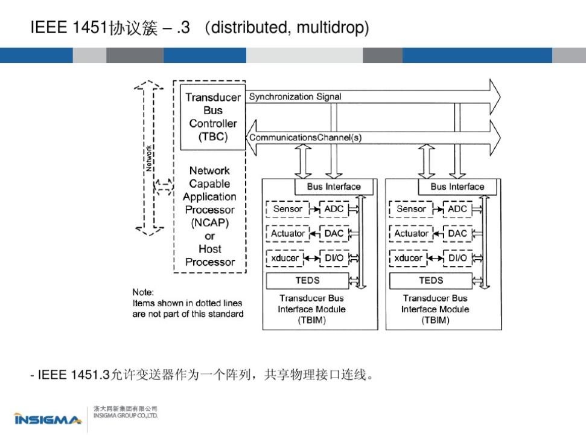

- 1451.4 描述数模混合接口的方式通讯，为传统的模拟传感器增加支持，传感器上电后先通过一根数字先发送 TEDS 给 NCAP，然后传感器用模拟线传递数据信息，此时与传统模拟传感器无异。

  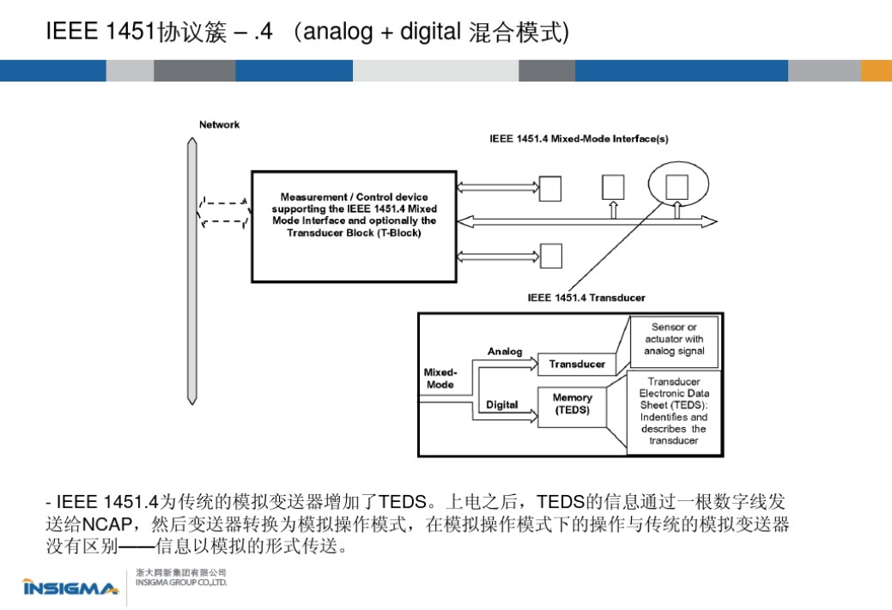

- 1451.5 描述无线（Wireless）的方式通讯（如 WLAN、BT、ZigBee 等），此时的 TIM 唤作 WTIM（Wireless Transducer Interface Module）。

  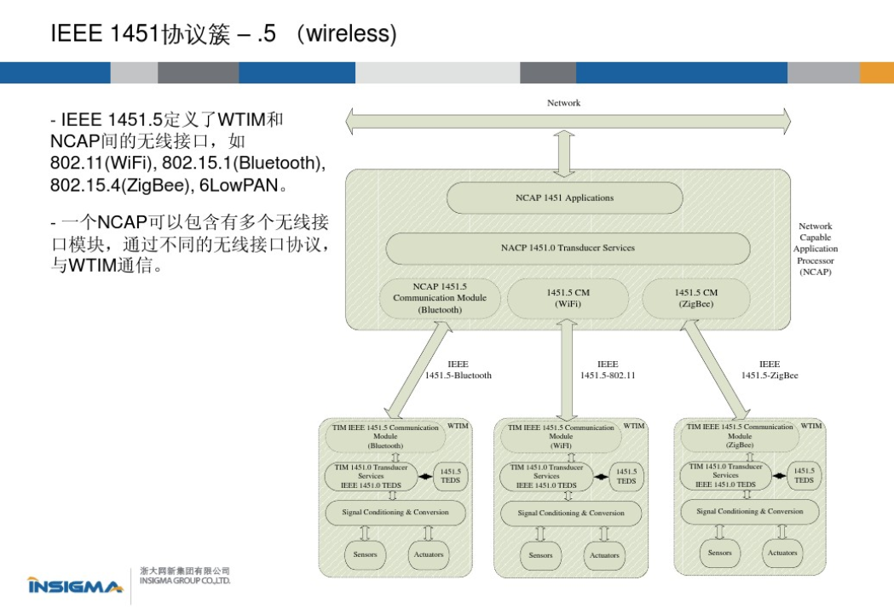

  

- 1451.6 描述在 CAN 总线物理层上利用 CANopen 协议进行通讯。

- 1451.7 描述利用 FRID 进行，扩展 RFID 系统的应用。

- 1451.1 描述 NCAP 与上面网络（Network）部分通讯的一种规范，是可选项，NCAP 入网的协议可以采用其它如 Web/HTTPS/MQTT 等。

于是一张细节丰富一点的 1451 整体模型逐渐清晰，如下图。可以发现，1451.4 接口的智能传感器 通常挂在 TIM 之下。

举一个例子，此时如果要根据这个图的架构搭建一个简易的测试用的 传感器采集并上传 的系统，如下图所示。橘色和绿色的部分是采用 1451.2 点对点的方式使 TIM 和 NCAP 通讯，这里使用 串口（UART），右边浅靛色部分是采用 1451.5 无线的方式实现 TIM 与 NCAP 通讯，多对一，各个 NCAP 上面都通过有线（网线）或者无线（WLAN）入网，下面的 TIM 可以实现灵活的接入自识别/自组网。

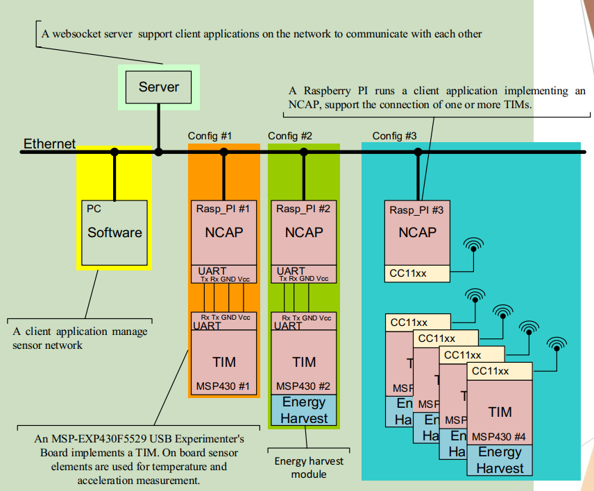

最后，1451 标准给出完整的整体模型，如下图。

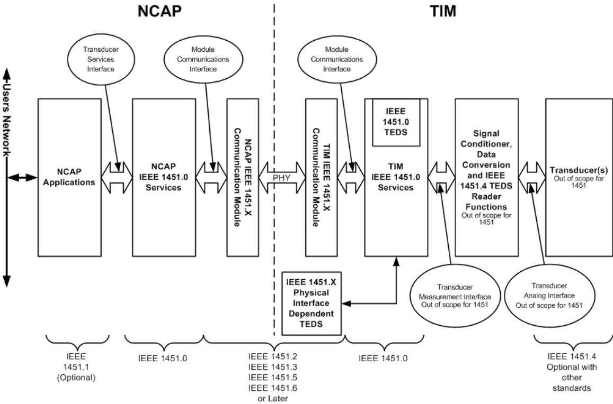

**可以看出 NCAP 与 TIM 之 间的接口被定义为 IEEE 1451.X 物理接口规范，根据不同的应用需求选择不同的子标准接口规范。1451.x 主要做数据中转，1451.0 主要做信息（message）和 TEDS 服务**，上图中标注 Optional 的部分为可选的。

由标准给出的架构图可知，NCAP 和 TIM 之间通过 1451.x（x = 2、3、5、6 等）进行交互，在 1451.x（做数据中转） 之外再加一层 1451.0（做信息（message）和 TEDS 服务） 。若 1451.0 种提供的功能等足够系统，可以只用 1451.0，即直接用于 NCAP 和 TIM 之间的交互，如下图所示（引自论文《IEEE_1451网络化智能传感器接口技术_王石记》）。

另外，一个 TIM 下面可以挂接多个 传感器，每一个传感器称为 一个传感器通道（Transducer Channel），一个 TIM 也可以挂接多个 执行器（Actuator，比如电机等），一个 TIM 下面也可以 连接多个 TIM，形成总分结构。

NCAP 对多个 TIM 的动态管理需要用户根据具体应用场景考虑，TIM 的接入、移出、命令/信息的收发等等。

## NCAP 与 TIM 通讯标准

**这里为 1451.0 标准，其他标准如 1451.2、1451.3、1451.4、1451.5 等 在 消息（message）和 TEDS 的定义上会有出入（各自有适应性改造），按需选择其中一个即可。**比如智能传感器系统中 NCAP 和 TIM 的通讯为 点对点的 有线的形式，则对于 消息（message）和 TEDS 的定义 看 1451.2 标准，如果为无线通讯形式，则对于 消息（message）和 TEDS 的定义 看 1451.5 标准。

### 通讯要素

模型 梳理好了，架构 在大脑中也形成了，就差它们中间流动的数字的通讯协议的规范。1451标准描述它们的通讯要素有以下方面：

- TEDS 的传递（递名片），TIM 自己的 TEDS 描述自己的信息（自描述），TIM 给 NCAP 发送自己的 TEDS（自识别），NCAP 可以发命令/数据来控制/读/写 TIM 的 TEDS。传感器自识别是 IEEE 1451 智能传感器的主要特点之一，TEDS 定义与配置是实现传感器自描述、自识别（即插即用）的核心技术。
- 数据的传递（干正事），以字节形式，高位先传（MSB），格式为用户自定（推荐使用“响应（Peply or Response）”的格式回传数据）；传输模式被定义为以下几种：1、NCAP 要时再给，2、TIM 缓存满时再给，3、TIM 固定周期性给，4、用户自定其它传输模式。
- 控制命令的传递（管一管），NCAP 和 TIM 可以相互发 控制命令消息（Command message）做请求（Request），接收方收到后必须予以响应（Response）。

除了数据传递，TEDS 和控制命令的发送都需要等待 响应/回复/应答，若超过 1s 不响应则以 1s 周期循环发送和等待，直到收到正常响应，如果超过一定次数还未收到响应则断连。

1451.0 标准主要针对自描述名片和消息（TEDS and message）的具体规范，以下开始具体介绍。

### 消息 的格式

TIM、NCAP 任一方接收到对方消息帧后须返回应答/响应/回复帧，若发送方在规定时间内没接收到对方确认应答帧则重新发送数据，直至发送成功或发送次数达到最大值。  

刨除数据的传递，消息（message）分为以下三种类型：

1. 命令（command）；
2. 响应/回复（Peply or Response）；
3. TIM 初始化完毕（TIM initiated）。

#### 命令消息

命令消息（Command message）一般为 NCAP 向 目标 TIM 的特定 通道（Destination TransducerChannel）发送一帧数据来请求（Request）TEDS（就是问，你谁啊？） 或者控制命令（就是下达命令）。TIM 接收到后予以响应（Response），响应的格式详见“响应/回复消息”一节。

Command message 格式如下表所示。

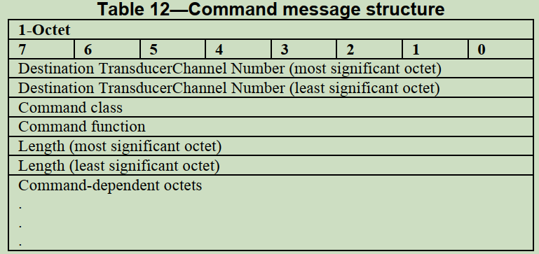

具体释义如下：

1. 前两个字节（Dest Channel Number）指示 目标 TIM 的 目标 通道标号（具体如何分配标号 在 1451.0 标准的 “5.3 Addresses” 一节给出）；或者第一个字节表示目标 TIM 编号，第二个字节表示 传感器通道编号；

2. 第三个字节（Command class）指示命令类别（Command class），具体值如下表，按需填入；

   

3. 第四个字节（Command function）指示具体的命令是什么，根据第三个字节的命令类别分为几大类。

   - 当第三个字节的命令类别（Command class）为 1，为通用命令（CommonCmd），则第四个字节填入下表中的标号以表示想要发送的具体命令。

     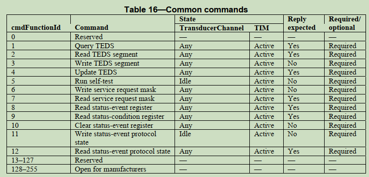

     1. 发送编号为 1 的 Query TEDS command（请求 TEDS 信息表命令） 命令，该命令带一个参数，即请求的 TEDS 的类型编号，详见下文 “TEDS 的格式” 一节的 Table-17。需要 TIM 响应/回应自己的 TEDS 的信息表，详见下表。响应/回复格式按照 “响应/回复消息” 一节描述的格式，下表为响应信息格式中 回复附带参数（Reply-dependent）部分的具体格式。

        

        该表具体释义如下：

        1. 第一个字节 为自己的 TEDS 属性，详见 “TEDS 属性” 一节；

        2. 第二个字节 为 TEDS 状态，详见下表；

           

        3. 第三、四、五、六个字节指示目前 TEDS 的字节数；

        4. 第七、八个字节为 TEDS 的校验值；

        5. 最后四个字节为 TEDS 的最大字节数。

     2. 发送编号为 2 的 Read TEDS segment command（读 TEDS 命令）命令，参数为 Table-21 所示，如下图。需要 TIM 回应自己的 TEDS，具体格式为：按照 “响应/回复消息” 一节描述的格式，其第 4 个字节开始的 附带信息 的格式为 Table-22 定义，如下图。TEDS 的格式具体见 “TEDS 的格式” 一节。

        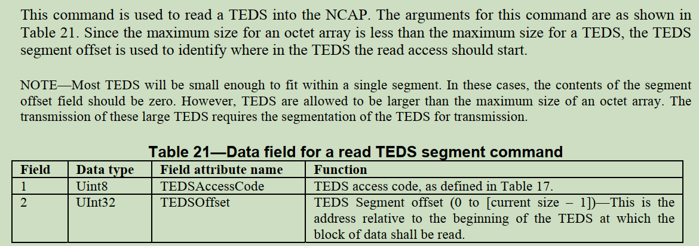

        上表中， TEDSOffset 为 TIM 传回信息中 TEDS 数据开始的偏移量，如果 TIM 回应 纯的 TEDS 数据，那么该值为 0 即可。

        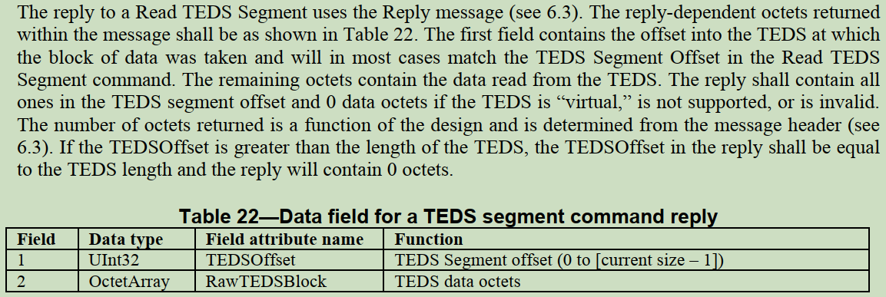

     3. 发送编号为 3 的 Write TEDS segment command（写 TEDS 命令） 命令，可以用于改写 目标 TIM 的 TEDS 的 某个部分。具体见标准 1451.0 的 7.1.1.3 一节。（太多了不想翻了，搞的那么繁杂）。

     4. 编号 4 的 Update TEDS command（更新 TEDS 命令），即使用 Write TEDS segment command（写 TEDS 命令）命令之后，再用该命令让 TIM 保存其刚接收到的新的 TEDS 到其非易失存储器（FLASH 或 EEPROM 等）内。命令参数为 TEDS 类型编号（Table-17），TIM 响应信息格式同Query TEDS command（请求 TEDS 信息表命令） 命令的回复格式。

        下面不一个一个细说了。

     5. 编号 5 的 Run self-test command（运行自测命令）。

     6. 编号 6 的 Write service request mask（写 NCAP 请求目标地址的掩码）。

     7. 编号 7 的 Read service request mask（有写就有读...）。以下编号依次类推。

     8. Read status-event register（读目标 TIM 或者 TIM 的传感器通道（Transducer Channel）的状态码）。

     9. Read status-condition register。

     10. Clear status-event register。

     11. Write status-event protocol state。

     12. Read status-event protocol state。

     13. 编号 128~255 的命令为用户保留，用户可自定义。

   - 前置定义，TIM 和传感器通道 的状态分类以及状态图定义，详见 “TIM/传感器 的状态图” 一节。当第三个字节的命令类别（Command class）为 2，即 传感器 空闲状态命令（XdcrIdle，Transducer idle state commands），该命令在 传感器 为 空闲状态（Idle）时才有效，其他状态无效。此时，第四个字节填入下表中的标号以表示想要发送的具体命令：

     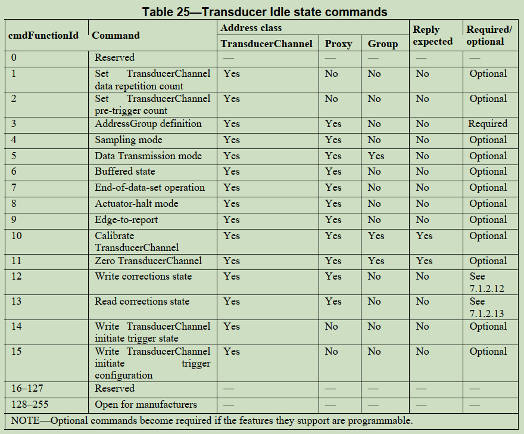

     不一一详细介绍了，具体看 1451.0 标准源文的 7.1.2 一节。

     - 编号 1 为设置 TIM 的传感器通道的数量。
     - 编号 2 为 设置 TIM 的某一个传感器通道能否在 free-running 状态下被设置为 pre-trigger 模式（关于 TIM 和 传感器通道的 状态和模式 定义详见 1451.0 标注源文的 5.10 一节）。
     - 编号 3 This command assigns a TransducerChannel to an AddressGroup.
     - 编号 4 设置 TIM 的某一个传感器通道的采集模式。
     - 编号 5 设置 TIM 数据传输模式。
     - 等等，太繁琐了。

   - 当第三个字节的命令类别（Command class）为 3，即 传感器 空闲状态命令（XdcrOperate，Transducer operating state commands），该命令在 传感器 为 工作状态（operational state）时才有效，其他状态无效。此时，第四个字节填入下表中的标号以表示想要发送的具体命令：

     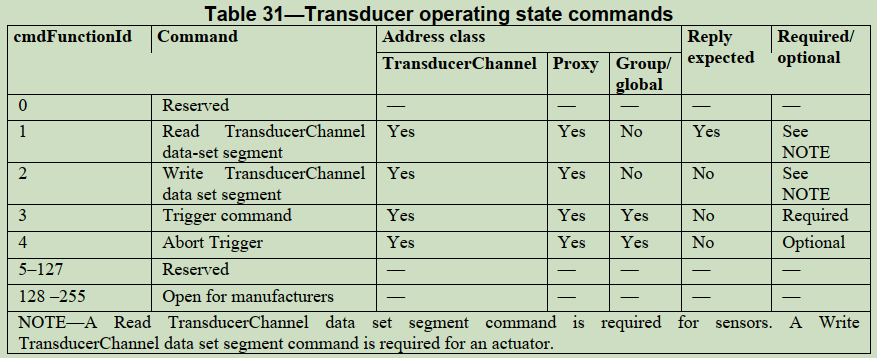

     1. 编号 1 为 Read TransducerChannel data-set segment（读传感器通道数据集）命令，带一个命令参数为返回的数据集中读数据起始位置的偏移，TIM 回应数据以 “响应/回复消息” 一节描述的格式，响应/回复参数为 1451.0 标准 Table-32 指定。
     2. 后面略。

   - 当第三个字节的命令类别（Command class）为 4，即 传感器 空闲状态或工作状态命令（XdcrEither，Transducer either idle or operating state commands），此命令类下的具体命令见 1451.0 标注源文的 Table-34。

   - 当第三个字节的命令类别（Command class）为 5，即 TIM 睡眠状态命令（TIM sleep state commands），该命令只在 TIM 睡眠状态下有效，此命令类下的具体命令见 1451.0 标注源文的 Table-35，用于唤醒，目前只此一个命令，其他均作保留。

   - 当第三个字节的命令类别（Command class）为 6，即 TIM 激活状态命令（TIM active state commands），该命令只在 TIM 激活状态下有效，此命令类下的具体命令见 1451.0 标注源文的 Table-36。

   - 当第三个字节的命令类别（Command class）为 7，即 TIM 任何状态命令（TIM any state commands），此命令类下的具体命令见 1451.0 标注源文的 Table-37，用于复位 TIM，目前只此一个命令，其他均作保留。

4. 第五、六个字节（Length）指示 附带的命令参数的字节数，接收方可据此判断何时接收完毕从而得到完整数据；

5. 往后（Command dependent）为根据具体的附带的命令的参数。

#### 响应/回复消息

一方接收到消息（Message）后予以响应/回应/回复（Peply or Response），其具体的的消息格式如下表所示。

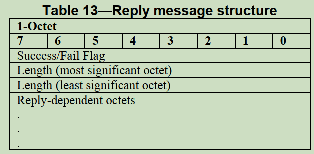

具体释义如下：

1. 第一个字节（Flag）：0 表示失败，其它值 表示成功；
2. 第二、三个字节（Length）：指示 Reply-dependent 部分的字节数，接收方可据此判断何时接收完毕从而得到完整数据；
3. 往后为 Reply-dependent 内容，根据收到的特定命令回应相应的信息。

#### 初始化完毕消息

TIM 初始化完毕后给 NCAP 发送一个 初始化完毕信息（TIM initiated message），其具体的的消息格式如下表所示。

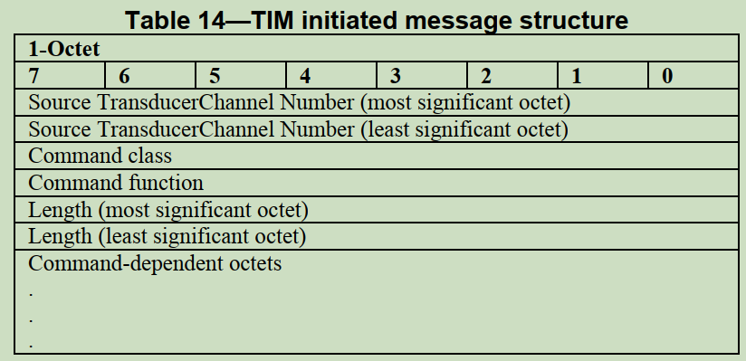

具体释义如下：

1. 前两个字节指示 本 TIM 的哪个通道 在发 此信息，即指示哪个通道初始化完毕了；
2. 其他格式 同 “命令消息”，具体详看同名小节。

### TEDS 的格式

> TEDS 包含一个仪器设备或测量系统，可对传感器进行识别、校正、连接及传感器数据信息的正确使用。具体信息有：厂商信息、模块编号、版本信息、产品序列号、灵敏度、测量范围、电气输出范围、功率要求、物理单位、校准信息、维护信息、位置信息以及用户数据等。
>
> TIM 一旦上电或接受了 请求 TEDS 的命令，TEDS 信息就上传到 NCAP。TEDS 简化了传感器的安装/部署，一个被损坏的传感器可以直接被替换而不需要更改任何设置。

TEDS 的所有类型如下图，第三列是该类型的名称。第一列的代号为 10 进制表示。

一个 TIM 必要有的四个 TEDS 类型如下，其他 TEDS 为可选。

- Meta-TEDS（描述所在 TIM 的基本信息、，传感器通道数、分组情况，详见 1451.0 标准的 8.4 小节）；
- TransducerChannel TEDS（描述 TIM 中特定传感器通道的详细信息，比如物理上实际的采集量、被控量，工作模式等，详见 1451.0 标准的 8.5 小节）；
- User’s Transducer Name TEDS（存储所在智能传感器的名称用于系统识别，用于，详见 1451.0 标准的 5.5.1.3 小节和 8.11 小节）；
- PHY TEDS（描述 TIM 与 NCAP 之间的物理连接的媒介，格式无标准定义，可用户自定）。

所有 TEDS 类型的格式如下（General format for TEDS）。

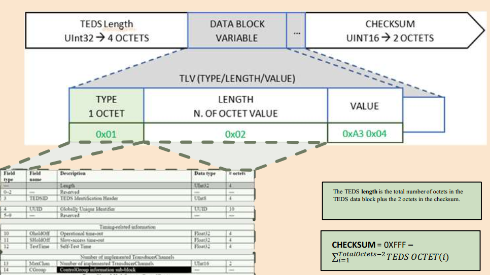

如上图所示，一帧数据的构建：

1. TED 长度（TED Length），包括 DATA BLOCK 和 CHECKSUM，字节为单位 （占 4 个字节）；

2. 数据区（DATA BLOCK）：

   1. 第一个域类（Field type）（占 1 个字节）；

   2. 第一个域类的 值的长度（Length of Value），字节为单位（占一个字节）；

   3. 第一个域类的值（Value）（占 值的长度 个字节）；

      

   4. 第二个域类（占 1 个字节）；

   5. 第二个域类的 值的长度，字节为单位（占一个字节）；

   6. 第二个域类的值（占 值的长度 个字节）；

      ...

   7. 以此类推。

3. 校验值（CHECKSUM），从 TED Length 到 DATA BLOCK 的最后一个字节加和，再用 0xFFF 减去该加和值（占两个字节）。

TEDS 的一些注意的点：

- TEDS 有 实TEDS 和 虚TEDS 之分，对于那些不能包含非易失存储器器件来保存 TEDS 的 TIM 就是用 虚TEDS，虚TEDS 保存在某个网络节点上，NCAP 索要 TEDS 的时候由该节点提供 TIM 的 TEDS ，实 TEDS 即 TEDS 信息真实的保存在 TIM 内部的非易失存储器。
- TEDS 的内容 在 TIM 执行器件可以根据传感器通道等的变化进行改动，或者接收到 NCAP 的改动 TEDS 的控制命令消息进行改动。
- 可以根据应用场景和开发限制来适当删减 TEDS 中一些冗长繁杂的格式。

#### Meta-TEDS 格式

描述所在 TIM 的基本信息、，传感器通道数、分组情况，详见 1451.0 标准的 8.4 小节。

该 TEDS 可以如何访问到：The Meta-TEDS is accessed using a Query TEDS command, a Read TEDS segment command, a write TEDS segment command, or an Update TEDS command.从 Table-17 可知该 TEDS 代号 01（10 进制）。该表的第一列 域类 号均为 10 进制表示。

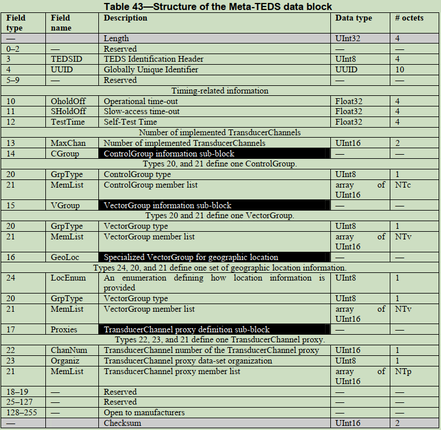

上表的各个域类不必全部给出，标好域类好就行。其具体说明如下：

- 开头为 TED 长度（TED Length），包括 DATA BLOCK 和 CHECKSUM，字节为单位，占 4 个字节；

- 数据区（DATA BLOCK）的第一个域类为 TEDSID，即 TEDS identification header，详见 本文 “TEDS 头” 一节；

- 第二个域类 UUID，全局独特身份码（名片上的大名），举例（16 进制）：`04 0a 8d 4d 9d a6 52 81 f7 00 00 00`，释义如下。

  

  UUID 的定义如下。

  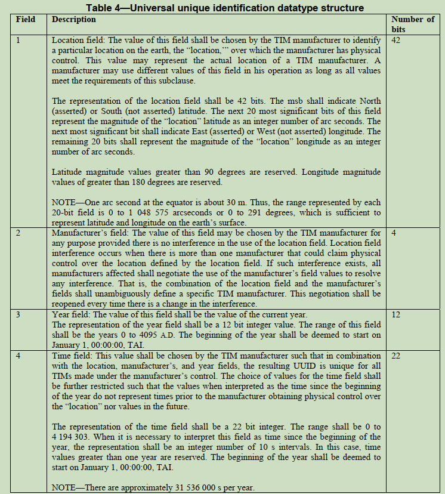

- 紧跟着三个域类分别是 操作超时时间、低速访问超时时间和自测试时间，举例如下。

  

  Float32 占用四个字节，具体编码描述： A single-precision real number is a 32 bit binary sequence that encodes real numbers as specified in IEEE Std 754-1985.

- 来到域类13，MaxChan，本智能传感器 TIM 下边连着几个 传感器通道（“传感器通道（Transducer Channel）” 这里英文缩写表示为 TCH）（比如采集三路模拟量），举例（16 进制）：`0d 02 00 03`，表示本 TIM 有 三个传感器通道。

- 其他域类...

- 最后两个字节做校验位，从 TED Length（最开头） 到 DATA BLOCK 的最后一个字节（本域类的上一个字节） 的加和，再用 0xFFF 减去该加和值。

上面的进行组合，这就是一帧 Meta-TEDS。

再举一个具体的例子（已经保姆级详尽了），如下图所示一个完整 Meta-TEDS。

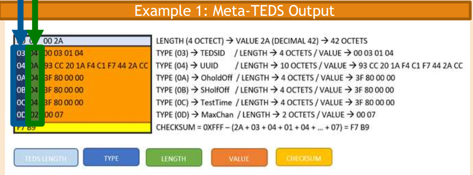

#### TransducerChannel TEDS  格式

该 TEDS 是为了确保 TIM 的所有 传感器通道（TCH）有必要信息从而可以被寻址和被操作。该 TEDS 描述 TIM 中特定传感器通道的详细信息，比如物理上实际的采集量、被控量，工作模式等，详见 1451.0 标准的 8.5 小节。

该 TEDS 可以如何访问到：The TransducerChannel TEDS is accessed using a Query TEDS command, a Read TEDS segment command, a write TEDS segment command, or an Update TEDS command.从 Table-17 可知该 TEDS 代号 03（10 进制）。该表的第一列 域类 号均为 10 进制表示。域类3 TEDSID 详见 “TEDS 头” 一节。

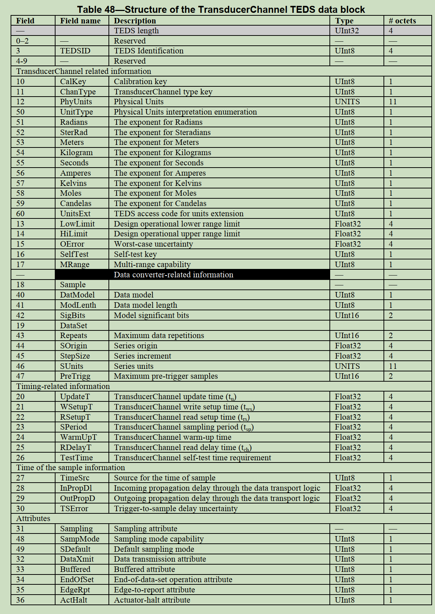

信息特别多了，以上每项的具体说明见 1451.0 标准的 “8.5.2 Data block” 章节。

#### User’s Transducer Name TEDS 格式

存储所在智能传感器的名称用于系统识别，用于，详见 1451.0 标准的 5.5.1.3 小节和 8.11 小节。

The User’s Transducer Name TEDS may be associated with the TIM or a TransducerChannel. It is accessed using a Query TEDS command, a Read TEDS segment command, a write TEDS segment command, or an Update TEDS command.从 Table-17 可知该 TEDS 代号 12。该表的第一列 域类 号均为 10 进制表示。域类3 TEDSID 详见 “TEDS 头” 一节。

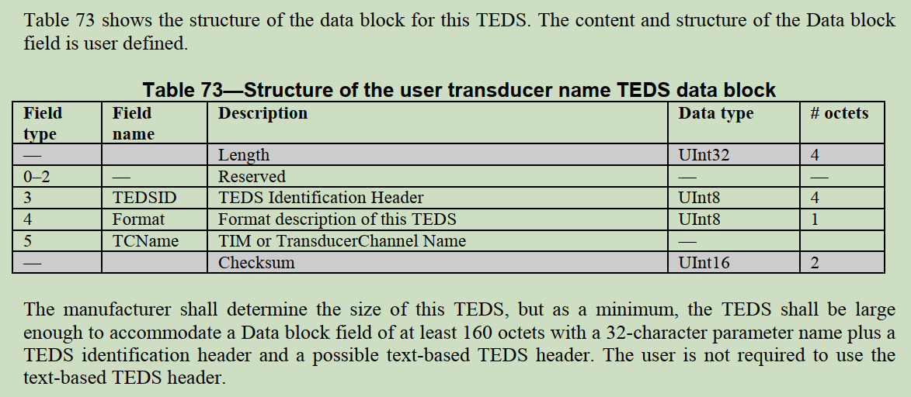

上表中域类4，即 format 详见下表（下表中 Field Name 一栏为 16 进制的 10，即 十进制的 4）。

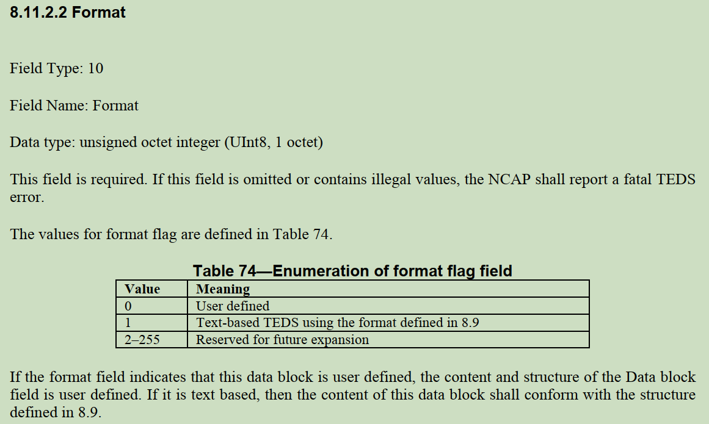

域类5，即 content，详见下表，内容用户自定， TIM 的名字，规范根据 域类 4 的 format 的值（0 为用户自定，1 为按照 标准中 8.9 Text-based TEDS 的规范来（又是一大堆））。

#### PHY TEDS 格式

1451.0 的一页源文。

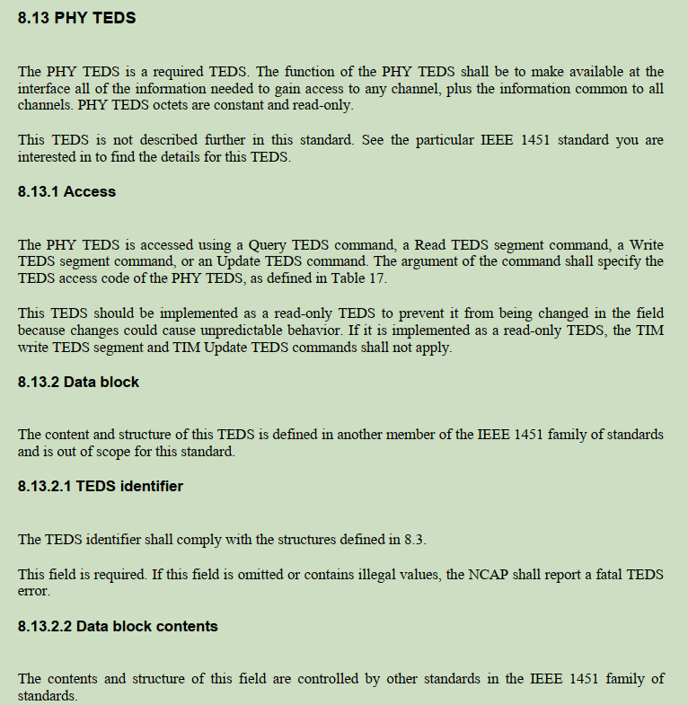

PHY TEDS 的具体格式定义在 1451.x（x = 2,3,4,5...）标准里，比如对于 1451.5 无线方式通讯，PHY TEDS 格式定义在其 5.3 一节。

#### TEDS 头

即 TEDS identification header，这是一个域类，定位于 Meta-TEDS 格式表中的 域类3 中，具体定义详见 1451.0 标准 8.3 小节，格式如下表所示。

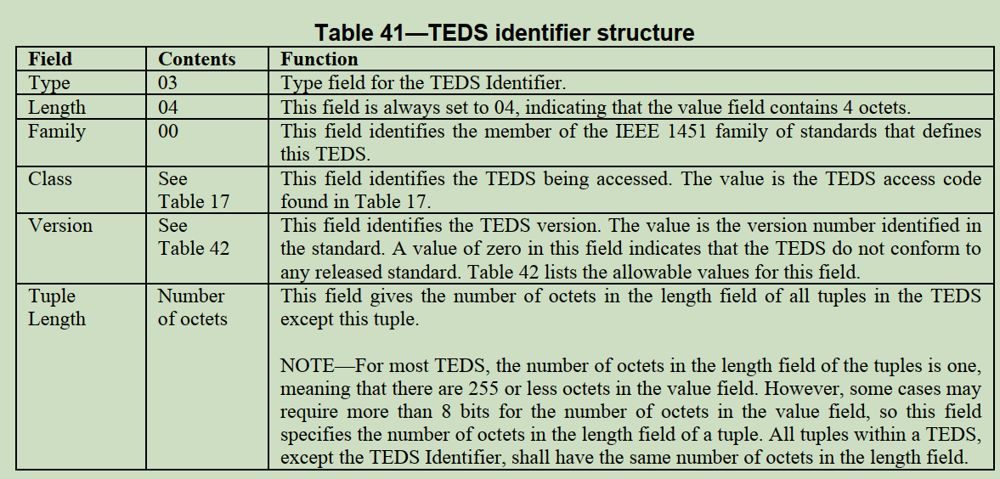

上表具体说明如下：

- 前面三个一般不变，为 `03 04 00`；需要说明，Family 域的值随着 使用 1451.x（x = 0,2,3,4,5...）标准而变，比如使用 1451.5，Family 域的值变为 05；

- 第四个域（Class 那里）为当前 TEDS 的类型编号，其具体值见上面 “TEDS 的所有类型” 的表（Table 17）；

- 第五个域（Version 那里）的具体值见下表（Table 42）；

  

- 第六个域（Tuple Length 那里）的具体值，即上面所说的“数据区（DATA BLOCK）”里面的“第 x 个域类的 值的长度（Length of Value）”这个域类所占几个字节，一般为 1。

则 TEDS identification header 这个域类的最终合成如右（举例，十六进制）：`03 04 00 01 01 01`，具体释义如下。

#### TEDS 属性

每个 TEDS 都有属性，在 请求 TEDS 命令（Query TEDS command）之后 TIM 响应 TEDS 时带着 该 TEDS 的属性信息。

TEDS 的属性可以设置为 只读，这样 NCAP 的修改 TEDS 的命令不会起作用。源文：TEDS may be implemented as a read-only TEDS to prevent changes from being made in the field because changes could cause unpredictable behavior. If it is implemented as a read-only TEDS, the TransducerChannel write TEDS segment and TransducerChannel Update TEDS commands shall not apply.

TEDS 属性具体定义如下表所示。

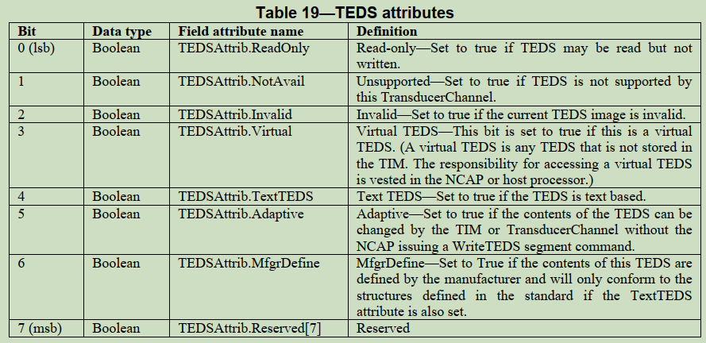

## TIM/传感器 的状态图

根据 1451.0，TIM 的状态分为两个部分，TIM 自己的状态以及 TIM 下面接的每一个传感器通道的模式状态，TIM 讲模式，传感器讲模式。

智能传感器的 TIM 状态转换图。

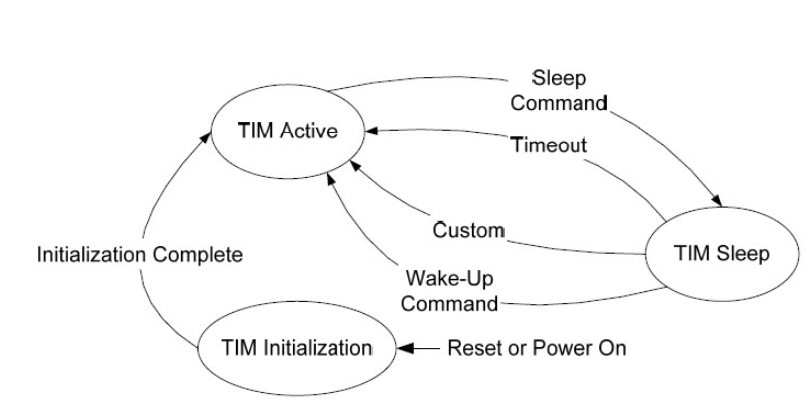

智能传感器 TIM 每一个传感器通道（TCH）的状态转换图（模式转换图）。

## 1451.5 标准

1451.5 标准中对于 1451.0 标准的一些新增/兼容部分，参考于 1451.5 标准源文。

1451.5 标准的变化之处举例：

- TIM 与 NCAP 的连接拓扑关系有新定义（5.1、5.2 小节）；
- NCAP 和 TIM 状态图新定义（5.4、5.5 小节）；
- 服务质量定义（5.6 小节）；
- 错误代号定义（5.7 小节）；
- message 不变；
- TEDS 除了 PHY TEDS，其他一样（5.3 小节）；
- WLAN 章节的一些特别定义（第 9 章）。

关于具体的 1451.5 标准的情况的介绍会在下一篇【读标准02】文章。

## 1451标准的局限性

以下记录一些推广上的局限性 和 一些疑问。

1. 把网络化智能传感器系统分为 NCAP 和 TIM 两个模块，而这两个模块都需要有微控制器（或微处理器），增加上手门槛和使用的复杂性。
2. 1451.x 标准 只能放在一起使用，与现有其他标准或者协议差异巨大，需要全新的重新开发。
3. 一个 NCAP 连接多个 TIM ，NCAP 该如何区分不同的 TIM，1451.5 定义吗？，还是用户自定？
4. 连续发了三个命令，陆续收到三个响应，三个收到的响应如何与三个命令一一对应起来？作者在此认为，响应/回复信息中的回复附带参数部分（Reply-dependent）首先填入接收到的命令的类（class）和具体命令这两个编号，然后才是真正的附带参数，这样 NCAP 可以区分该 回复是针对哪个命令的，NCAP 可以据此差异性解析，提高交互并发性，而不用发出一个命令后只能先等。不过标准也许有对这一块的定义，可能源文几百页太长了作者没注意到。
6. TEDS 在尽量包含所有传感器类型的描述信息，但不可能穷举所有传感器类型；对于应用层没有对数据格式做规范。简而言之，本文作者认为综合性、一般性模型的目标不算尽善尽美的达到。
6. 与一般标准的一样，体系庞大，内容非常复杂 ，人们理解起来非常费时费力；如今嵌入式处理器应用越来越广，低成本和低功耗的考虑越来越多，因此人们可能只能执行标准的一部分。
7. 制定标准时不容易或者没有处理好与已有标准协议的关系。（6、7 条引自论文《海洋观测网络化智能接口标准的研究_张帅》）
8. 
