# IEEE 1451.5 智能无线传感器标准介绍

这里介绍 1451.5 标准中对于 1451.0 标准的一些新增/兼容部分的介绍，参考于 1451.5 标准源文。图片侵删。对于个人，如果业余时间想玩玩，把这个标准用起来，实现并且体验一下各个组件神奇的“自识别、自组网”、“即插即用”的话，主要在于实现 【读标准01】那篇文章里介绍的 1451.0 标准定义的 消息（message）和电子数据表格（TEDS）这两大功能，并且不用把标准所描述的都实现，实现其中自认为关键的/不可或缺的一部分即可。

------

## 1451.5 的基本拓扑

> 图源：论文《基于IEEE_1451.5标准的物联网体系结构设计_陶星珍》
>
> 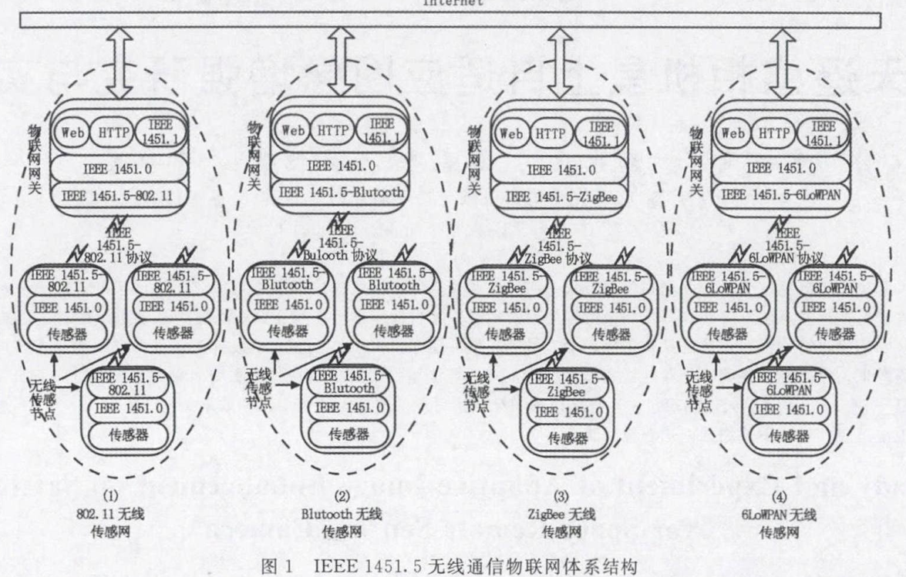
>
> 网关与传感器节点通讯流程图如图 5 所示。当传感器节点上电后，自动向网关广播一条消息，然后等待网关回应；网关收到来自传感器节点的消息后，对其进行解析，分析出命令的类号和功能号，然后做出应答，比如读取传感器的数据、读取传感器的 TEDS 或者写传感器的 TEDS等；当床啊七年节点收到后，将根据 1451.0 格式生成应答消息发回网关。
>
> 1451.5 拓扑 协议栈如下图所示。
>
> 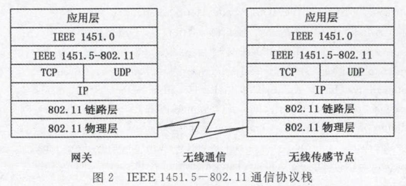

### 一个实例

> 1451.5 智能称重传感器系统架构如下图所示。图源：论文《基于IEEE_1451.5的高精度智能称重传感器系统_陈耿新》
>
> 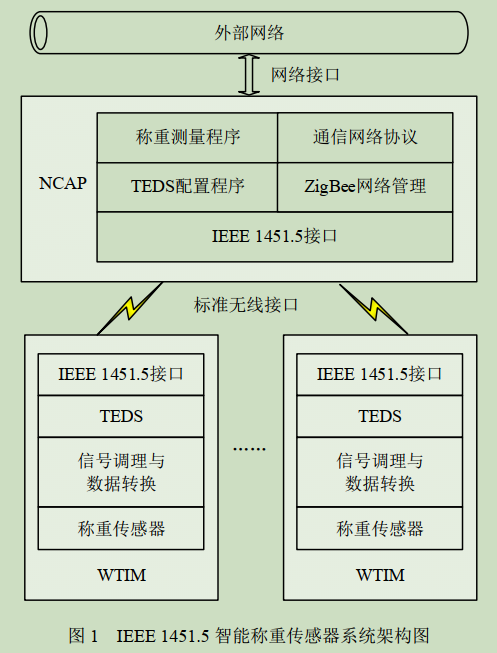
>
> 上面实例中，1451.5 智能称重传感器系统传感器自识别流程如下图所示。
>
> 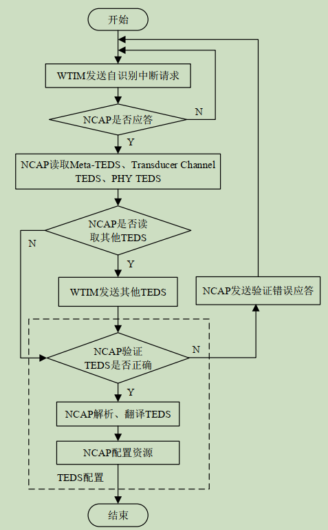
>
> WTIM 在成功接入 ZigBee 网络后，向 NCAP 发送自识别中断请求开始自识别操作； WTIM、NCAP 任一方接收到对方消息帧后须返回确认应答
> 帧，若发送方在规定时间内没接收到对方确认应答帧则重新发送数据，直至发送成功或发送次数达到最大值。
>
> TEDS 配置是 IEEE 1451 智能传感器自识别的关键环节。TEDS 配置流程包括： NCAP 接收到各TEDS 后，需通过校验和字段验证其完整性、正确性；对通过验证的 TEDS 进行解析、翻译，获取WTIM 及其通道相关信息、 参数， 再根据这些信息、参数配置相关资源以完成后续功能，如 NCAP 配置校正引擎相关参数实现数据解耦、校正。

### 即插即用性能测试

> 引用：论文《基于IEEE_1451.5的高精度智能称重传感器系统_陈耿新》
>
> 以平均初次入网时间 tf、平均重新入网时间 tr、平均断网识别时间 tc作为评价指标。  
>
> - 平均初次入网时间 tf 定义为从 WTIM 首次向 NCAP 发送入网请求，直至其收到 NCAP 入网确认所需的平均时间； 
> - 平均重新入网时间 tr 定义为已加入网络的 WTIM 断开连接后， 从WTIM 再次发送入网请求， 直至其收到 NCAP 入网确认所需的平均时间；
> - 平均断网识别时间 tc 定义为从WTIM 发生故障或断电开始，到 NCAP 识别 WTIM 断网所用的平均时间。
>
>  tf， tr， tc 越小，智能称重传感器 ZigBee 接口即插即用性能越好。  
>
> 智能传感器系统 ZigBee 接口即插即用测试结果如下表所示。
>
> 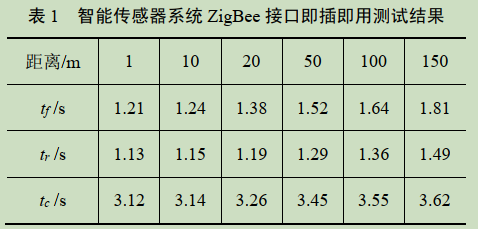

## 1451.5 标准的变化之处举例

1451.5 标准参考模型、物理层 TEDS（PHY TEDS） 和命令遵循 1451.0 标准。但是变化之处举例如下。

- TIM 与 NCAP 的连接拓扑关系有新定义（5.1、5.2 小节）；
- NCAP 和 TIM 状态图新定义（5.4、5.5 小节）；
- 服务质量定义（5.6 小节）；
- 错误代号定义（5.7 小节）；
- 命令集；
- TEDS 除了 PHY TEDS，其他一样（5.3 小节）；
- WLAN 章节的一些特别定义（第 9 章）。

以下 TIM 都叫做 WTIM（Wireless Transducer Interface Module）。

## 连接拓扑

NCAP 和 WTIM 的连接拓扑基本与 1451.0 中定义的 NCAP 和 TIM 一致，但 NCAP 与 WTIM 的通讯按照 1451.5 标准来。

以下是 1451.5 定义的 NCAP 与 WTIM 的角色关系。

- An NCAP may route commands and data from an external network to/from a transducer connected to a WTIM.
- An NCAP may register multiple WTIMs.
- A WTIM shall only be registered with a single NCAP.
- A WTIM may interface to multiple transducers.
- WTIM-to-WTIM communication is allowed.

## 状态图

对于 NCAP 只是上电后有两个状态，一个是未连接 WTIM ，一个是连接了，对于 WTIM 状态有三个，前两个一样，在脸上之后，WTIM 给 NCAP 发送自己的 TEDS，告知自己的处于开放（Open）状态的传感器通道，并切到 开放状态，若 NCAP 回应则切回连接状态开始正常工作。具体 参考 1451.5 标准源文 5.4、5.5 小节。

## 服务质量定义

服务质量（Quality of service，QoS）用于描述 NCAP 的服务质量，主要表现在 WTIM 对 NCAP 的请求或者传输命令/信息时候 NCAP 的回应延迟时间，举例来说，若前者时间超过 2 秒，或者后者时间超过 20ms，那么 WTIM 可以认为该 NCAP 的服务质量比较次，可以主动断开无线连接。具体 参考 1451.5 标准源文 5.6 小节。

## 错误代号定义

用于标记 NCAP 或者 WTIM 在 1451 标准定义的协议的范畴上出现失败的情况的类型，比如标记了是 NCAP 或者 WTIM 的错误位置（位于 1451.0 还是 1451.5 层），以及在这一层，是目标地址错了、操作超时了、网络 下线了、TEDS 的格式错了等等等等。具体 参考 1451.5 标准源文  5.7 小节。

## 命令集

NVAP 与 WTIM 通讯的信息协议格式与 1451.0 是一样的，只是改成借 1451.5 这一层当作中间原样传输层，这里定义了 1451.0 层调用 1451.5 层的中间的要有的一些 API。具体 参考 1451.5 标准源文  5.7 / 9.2 小节。

## PHY TEDS

TEDS 的格式为 1451.0 定义的，如下：

1. TED 长度（TED Length），包括 DATA BLOCK 和 CHECKSUM，字节为单位 （占 4 个字节）；

2. 数据区（DATA BLOCK）：

   1. 第一个域类（Field type）（占 1 个字节）；

   2. 第一个域类的 值的长度（Length of Value），字节为单位（占一个字节）；

   3. 第一个域类的值（Value）（占 值的长度 个字节）；

      

   4. 第二个域类（占 1 个字节）；

   5. 第二个域类的 值的长度，字节为单位（占一个字节）；

   6. 第二个域类的值（占 值的长度 个字节）；

      ...

   7. 以此类推。

3. 校验值（CHECKSUM），从 TED Length 到 DATA BLOCK 的最后一个字节加和，再用 0xFFF 减去该加和值（占两个字节）。

其中 数据区（DATA BLOCK）各个域类的具体定义如下表所示。

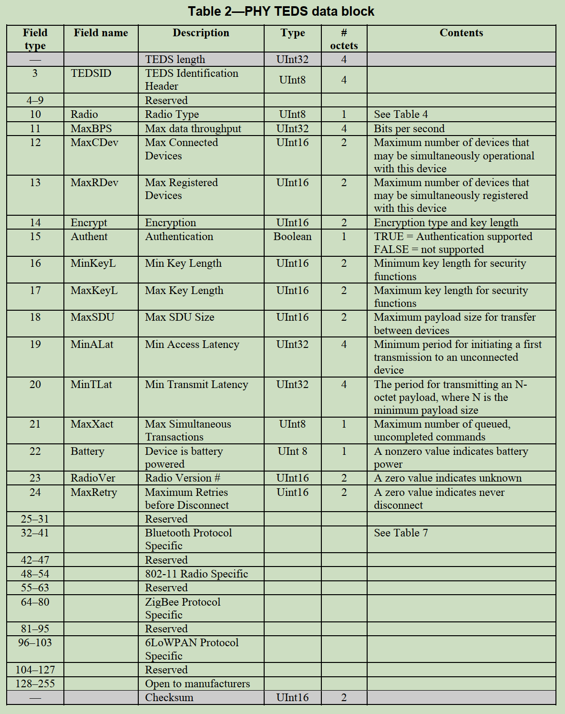

释义如下：

- 域类 3，TEDS 头，值占四个字节，具体定义如下；

  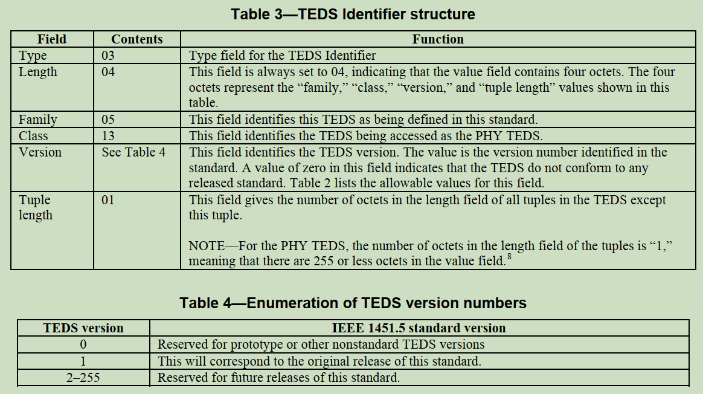

- 域类 10，无线类型，值占一个字节，具体定义如下；

  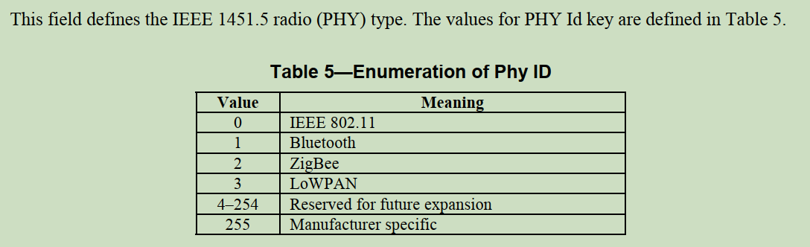

- 域类 11，速度（bit / s），值占四个字节；

- 域类 12，与此设备的最大连接的可操作设备数，值占两个字节；

- 域类 13，与此节点的最大无线连接数，值占两个字节；

- 域类 14，加密特性，值占两个字节，第一个字节指示加密算法，第二个字节指示加密长度（单位：bit）；

- 等等等等，后面的具体看源文。授人以渔了已经。

## NCAP 和 WTIM 流程图

一下内容引自论文《基于IEEE1451.5标准网络传感器的研发_杨吉语》。

WTIM 程序流程图。

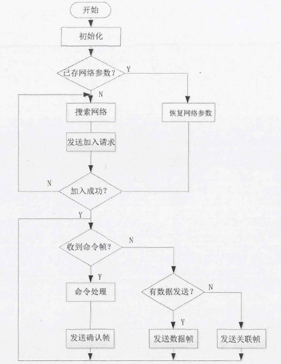

NCAP 程序流程图。

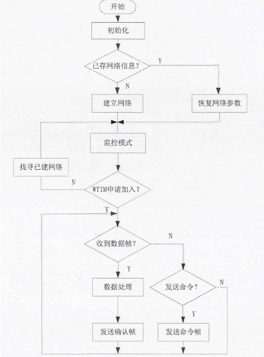

传感器即插即用功能实现流程图。

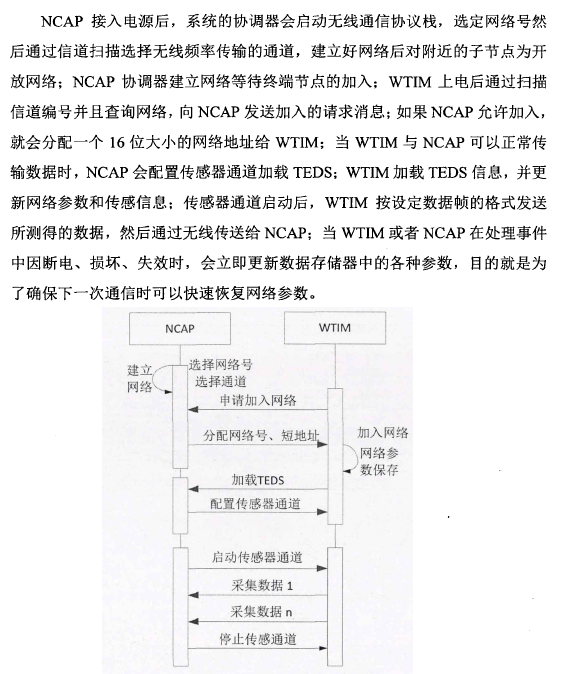

## 一些注意事项

1. 为了减少多个 TIM 上电后同时给 NCAP 发送 TEDS 信息而造成数据量突增，TIM 应该等待 NCAP 的发送 TEDS 的命令，然后再发送，而不是一上电就主动发送。TIM 都听从 NCAP 来指挥调度，遵守“交通”规则。
2. TIM、NCAP 任一方接收到对方消息帧后须返回应答/响应/回复帧，若发送方在规定时间内没接收到对方确认应答帧则重新发送数据，直至发送成功或发送次数达到最大值。  
3. NCAP 与 TIM 建立连接后，在空闲时，与 TIM 心跳通讯，若有连续一定次数的不回应则断连。
4. 使用 WLAN 时候，TIM 将自己的 IP 地址、端口等也存储在 PHY-TEDS 中。
5. 实现的时候要充分考虑系统的扩展性、模块独立性和可移植性，比如还有 NCAP 适应 TIM 的增加入网，TIM 适应多个传感器通道的增加等，还要保持处理算法的小运算量，时间和空间复杂度控制住。
6. 其他【读标准01】文章中提到的注意点。
