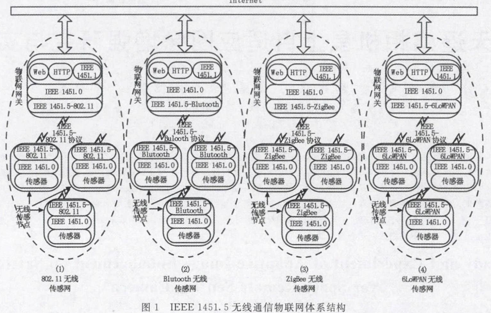
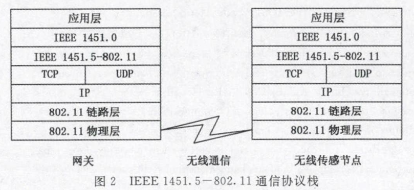
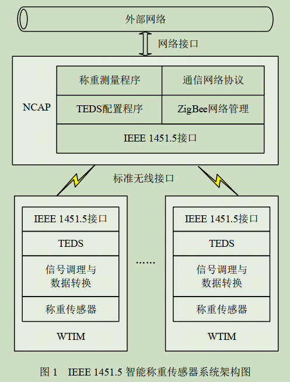
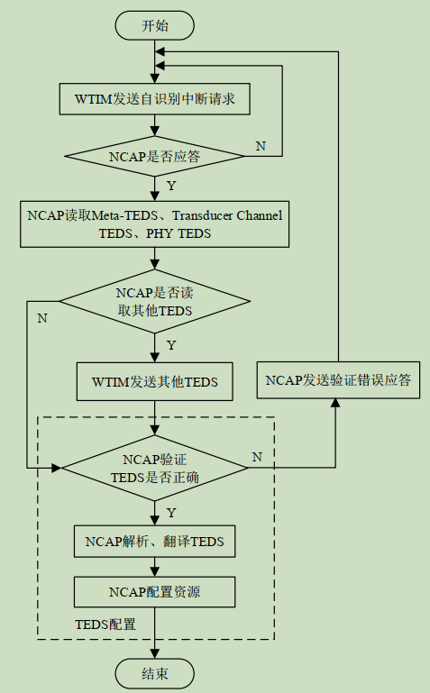
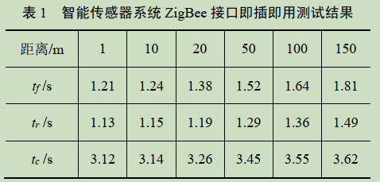

# IEEE 1541.5 智能无线传感器标准介绍

这里介绍 1451.5 标准中对于 1451.0 标准的一些新增/兼容部分的介绍，参考于 1451.5 标准源文。图片侵删。

------

## 1451.5 的基本拓扑

图源：论文《基于IEEE_1451.5标准的物联网体系结构设计_陶星珍》

> 网关与传感器节点通讯流程图如图 5 所示。当传感器节点上电后，自动向网关广播一条消息，然后等待网关回应；网关收到来自传感器节点的消息后，对其进行解析，分析出命令的类号和功能号，然后做出应答，比如读取传感器的数据、读取传感器的 TEDS 或者写传感器的 TEDS等；当床啊七年节点收到后，将根据 1451.0 格式生成应答消息发回网关。

1451.5 拓扑 协议栈如下图所示。

### 一个实例

1451.5 智能称重传感器系统架构如下图所示。图源：论文《基于IEEE_1451.5的高精度智能称重传感器系统_陈耿新》

上面实例中，1451.5 智能称重传感器系统传感器自识别流程如下图所示。

> WTIM 在成功接入 ZigBee 网络后，向 NCAP 发送自识别中断请求开始自识别操作； WTIM、NCAP 任一方接收到对方消息帧后须返回确认应答
> 帧，若发送方在规定时间内没接收到对方确认应答帧则重新发送数据，直至发送成功或发送次数达到最大值。
>
> TEDS 配置是 IEEE 1451 智能传感器自识别的关键环节。TEDS 配置流程包括： NCAP 接收到各TEDS 后，需通过校验和字段验证其完整性、正确性；对通过验证的 TEDS 进行解析、翻译，获取WTIM 及其通道相关信息、 参数， 再根据这些信息、参数配置相关资源以完成后续功能，如 NCAP 配置校正引擎相关参数实现数据解耦、校正。

### 即插即用性能测试

> 引用：论文《基于IEEE_1451.5的高精度智能称重传感器系统_陈耿新》
>
> 以平均初次入网时间 tf、平均重新入网时间 tr、平均断网识别时间 tc作为评价指标。  
>
> - 平均初次入网时间 tf 定义为从 WTIM 首次向 NCAP 发送入网请求，直至其收到 NCAP 入网确认所需的平均时间； 
> - 平均重新入网时间 tr 定义为已加入网络的 WTIM 断开连接后， 从WTIM 再次发送入网请求， 直至其收到 NCAP 入网确认所需的平均时间；
> - 平均断网识别时间 tc 定义为从WTIM 发生故障或断电开始，到 NCAP 识别 WTIM 断网所用的平均时间。
>
>  tf， tr， tc 越小，智能称重传感器 ZigBee 接口即插即用性能越好。  
>
> 智能传感器系统 ZigBee 接口即插即用测试结果如下表所示。
>
> 

## 1451.5 标准的变化之处举例

1451.5 标准参考模型、物理层 TEDS（PHY TEDS） 和命令遵循 1451.0 标准。但是变化之处举例如下。

- TIM 与 NCAP 的连接拓扑关系有新定义（5.1、5.2 小节）；
- NCAP 和 TIM 状态图新定义（5.4、5.5 小节）；
- 服务质量定义（5.6 小节）；
- 错误代号定义（5.7 小节）；
- 命令集；
- TEDS 除了 PHY TEDS，其他一样（5.3 小节）；
- WLAN 章节的一些特别定义（第 9 章）。

## 连接拓扑

## 状态图

## 服务质量定义

## 错误代号定义

## 命令集

## PHY TEDS

## WLAN 特别定义

